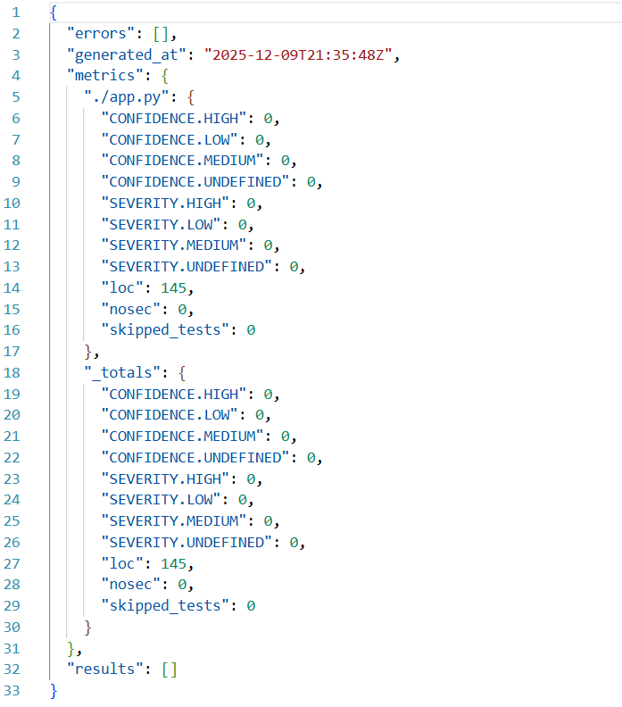

*Информационная безопасность*
# Лабораторная работа №1

## Описание проекта

Это небольшое REST API приложение, которое дает возможность пользователям регистрироваться в нем, просматривать других зарегистрированных участников или удалить свой аккаунт. Можно представить, что пользователи регистрируются для участия в небольшом событии, вроде Тайного Санты.

### Используемые технологии:
- `Python\Flask` -- основа
- `Sqlite` -- база данных 
- `Bandit` -- инструмент SAST
- `Snyk` -- инструмент SCA

### API

- `POST /auth/login` -- зарегистрироваться или войти
   - username
   - password
   - Возвращает jwt `token` и данные о пользователе

- `GET /api/data` -- получить список всех пользователей
    - только для аутентифицированных пользователей

- `DELETE /auth/user` -- удалить свой аккаунт
    - только для аутентифицированных пользователей

## Реализованные меры защиты

### Обработка имени пользователя

Имя пользователя может содержать только буквы или цифры и не должно быть длиннее 32 символов. Также удаляются пробельные символы в начале и конце строки.

### Метод хранения паролей

Пароли не хранятся в открытом виде, а хэшируются при помощи `bcrypt` с добавлением соли. 

### Аутентификация пользователя

При регистрации или входе в систему пользователю возвращается jwt токен, который должен быть вставлен в заголовок `Authorization` для доступа к путям, помеченным декоратором `@jwt_required`. В токене содержится id пользователя, а также время создания и истечения срока действия токена. 

### Параметризация запросов

Для доступа к базе данных используются только параметризованные запросы.

## Результат проверок

### Bandit

### Snyk

